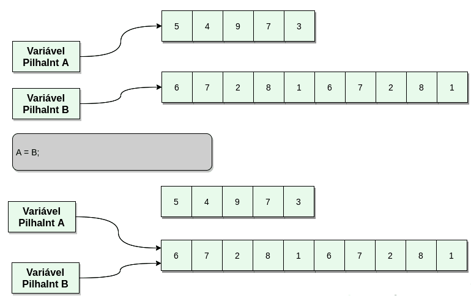
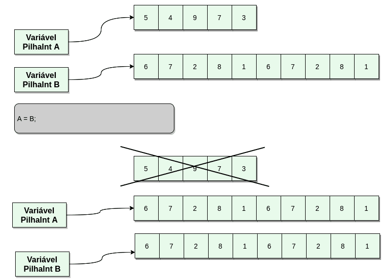

# Trabalho 2
## Classe PilhaInt - Alocação Dinâmica

PilhaInt com Alocação Dinâmica de Memória.

Partindo da implementação da Classe PilhaInt e adaptando os métodos que já foram implementados (empilha, desempilha, print, operator<<, operator=), você irá permitir a alteração dinâmica do tamanho da pilha (no exercício anterior o tamanho da pilha era pré-definido). Para isso, nesse exercício, você deve (é obrigatório!) usar um ponteiro para um array de inteiros - int*. A forma de alocação deve (obrigatoriamente!) utilizar apenas as funções malloc/free/realloc. 

Note que quando usamos ponteiros devemos tomar cuidado com a atribuição e cópia de variáveis para não acontecer como na figura abaixo:



Quando ocorre a atribuição de B em A não se deve fazer a atribuição campo a campo pois isso significaria atribuir os ponteiros, fazendo-os apontar para o mesmo endereço de memória. Além disso, perdemos o endereço do bloco de memória usado anteriormente por A, e ele não será mais desalocado (ocorrendo um memory leak). 

Deve-se verificar se os tamanhos dos arrays de A e B são diferentes, e se forem, alocar um array novo para A com o mesmo tamanho do array de B, e desalocar o antigo array de A. Estando os tamanhos dos arrays iguais, deve-se percorrer os arrays copiando os elementos um a um de B para A. Note que na passagem de parâmetros por cópia teremos o mesmo problema. A imagem a seguir ilustra esse caso:



Implemente as seguintes funcionalidades:

- Um constructor com um parâmetro capacidade (o tamanho da pilha) que deverá alocar dinamicamente o array que irá armazenar a pilha, usando malloc e inicializado com zeros - esse construtor irá ter um valor default igual a 10;
    - Valores default são indicados através de uma atribuição no cabeçalho da rotina: PilhaInt( int tamanho = 10 ) { ... }


- Um copy constructor, que irá criar uma cópia do array alocado, contendo os mesmos elementos da pilha anterior;

- Um destructor que irá desalocar o ponteiro alocado no constructor;

- Um operador de atribuição com o comportamento descrito acima;

- Um método capacidade() que retorna a capacidade da pilha;

- Um método redimensiona(int n), que altera a capacidade da pilha. Se a nova capacidade for menor do que o número de elementos atualmente na pilha deve-se desempilhar o número suficiente de elementos para adequar a pilha à nova capacidade.

- Sempre que a pilha estourar (o topo ultrapassar a capacidade) ela deve ser realocada com o dobro do tamanho atual;
Envie um único arquivo pilha.cc (ou copie e cole no editor) contendo apenas a definição da classe. Não é permitido nenhum " #include", nem o uso de nenhum biblioteca além da iostream (que será incluída pelo meu programa principal). Não coloque nesse arquivo a função main, ou dará erro de compilação.

Exemplo de pilha.cc:

```
class PilhaInt {
  public:
    // Seus métodos contendo o seu código
  private:
    // Atributos da sua classe
};
```

Os testes irão utilizar a função auxilar listada abaixo para testar o construtor de cópia:

```
PilhaInt embaralha( PilhaInt q ) {
    int aux = q.desempilha();
    q << 32 << 9 << aux;
    
    return q;
}
```
