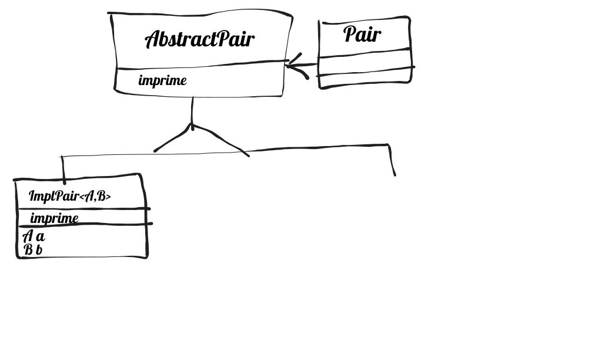

# Trabalho 8
## Print com lista de tuplas - teste do destructor

Faça uma template ou função "print" que recebe um lista de pares de tipos variáveis e as imprime. Isso pode ser feito usando pair ou tuple com dois elementos.

Um exemplo de declaração seria:

```
int main() {
 
  print( cout, { { "jan", 1 }, { 2, "fev" }, { string( "pi" ), 3.14 } } );
  
  return 0;  
}
```

que deve imprimir:

```
jan = 1
2 = fev
pi = 3.14
```

Como a lista de pares a serem impressos é uniforme, de apenas um tipo, precisaremos de uma hierarquia para poder usar o polimorfismo. Dessa forma, devemos ter uma classe AbstractPair, abstrata, e dela derivar uma classe PairImpl<A,B>, template nos tipos de cada par. A classe Pair deve ter um ponteiro para a classe AbstractPair.

Passos iniciais:

```
#include <initializer_list>
#include <iostream>

using namespace std;

class Pair {
public:
  template <typename A, typename B>
  Pair( A a, B b ) {
    // código aqui...
  }
private:
  AbstractPair *p;
};

void print( ostream& o, initializer_list<Pair> lista ) {}

int main() {
 
    Pair p( "1", 2 );
  
    print( cout, { { "jan", 1 }, { 2, "fev" }, { string( "pi" ), 3.14 } } );

  return 0;  
}
```

Note que o construtor da classe Pair é uma template, embora a classe em si não o seja.
OBS: Para inviabilizar uma solução simples que seria imprimir os pares no construtor da classe Pair não é permitido utilizar algumas classes da STL neste trabalho, dentre elas string e cout.
Sugestão para as classes:



