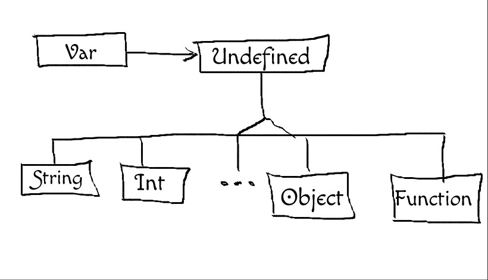

# Trabalho 10
## Objeto com tipo variável

O objetivo desse trabalho é criar uma classe Var semelhante às variáveis do Javascript, que podem receber valores de vários tipos diferentes e durante a execução vão mudando internamente de tipo. Assim, uma variável pode ser criada como string e depois um double pode lhe ser atribuído, mudando o seu tipo. Se ela for um objeto, pode ter atributos que podem ser outras variáveis ou mesmo funções - semelhante ao que ocorre é Javascript. Nesse momento pense apenas na clareza, elegância e facilidade de implementação - ignore qualquer tentativa de otimização que possa surgir na sua mente durante a codificação.  Um exemplo de uso segue abaixo:

```cpp
#include <iostream>
#include <string>
#include <type_traits>
#include <vector>

using namespace std;

int main() {
  Var a, b;
  
  cout << a << endl; // saída: "undefined"
  a = 1;
  cout << a << endl; // saída: 1
  a = "hello";
  cout << a << endl; // saída: hello
  
  a = newObject();
  a["atr"] = 9;
  a->*"atr" = 4.5;
  a["metodo"] = []( auto x ){ return x*x; };
  b = 4;
  cout << a["metodo"]( b ) << endl; // Saída: 16;
}
```

Sugestão:

Crie uma classe Var que possui um ponteiro para a base de uma hierarquia dos tipos que serão possíveis na linguagem, como Int, Char, Double, Object, Function, Array etc. Seria algo assim:



Código inicial:

```cpp
class Undefined {
};

class Int: public Undefined {
public:
  Int( int n ):n(n) {}
private:
  int n;
};

class String: public Undefined {
};

class Var {
public:
  Var(): valor( new Undefined() ) {}
  
  Var operator = ( int n ) {
    valor = shared_ptr<Undefined>( new Int( n ) );
  }
  Var operator = ( double n ) {
    valor = shared_ptr<Undefined>( new Double( n ) );
  }
private:
  shared_ptr<Undefined> valor;
};
```


Operadores Lógicos, Relacionais e Aritméticos:

Olhe o Double Dispatch para ter uma idéia de como implementar as operações aritméticas. Há três opções e considerações a respeito de cada uma delas. Você pode escolher qualquer uma das três abordagens sugeridas, ou ainda desenvolver uma abordagem própria. As operações que não estiverem definidas não devem gerar erros mas sim retornar o valor Undefined. Será necessário implementar apenas os seguintes operadores: +, -, *, /,<,  !, && e || (adição, subtração, multiplicação, divisão, menor, "not", "and" e "or").


Erros e exceções:

Nos testes estará definido quando se deve sinalizar uma exceção ou simplesmente produzir como saída um resultado Undefined. Quando for necessário sinalizar uma exceção use a classe abaixo:

```cpp
// Use essa classe para sinalizar exceções.
class Erro {
public:
  Erro( string msg ): msg(msg) {}
  
  string operator()() const {
    return msg;
  }
  
private:
  string msg;
};
```

Exemplo:

```cpp
a = 1;
a();
```

Deve gerar uma exceção:

```cpp
throw Erro( "Int não pode ser usado como função" );
```

Arquivo usado para execução:

```cpp
#include <vector>
#include <iostream>
#include <math.h>
#include <string>
#include <map>
#include <type_traits>
#include <functional>

#include "var.cc"

using namespace std;

Var print( const Var& o ) {
  cout << "{ nome: " << o["nome"]
       << ", idade: " << o["idade"]( o )
       << ", nascimento: " << o["nascimento"]
       << ", print: " << o["print"] 
       << ", atr: " << o["atr"] 
       << " }" << endl;
       
  return Var();     
}

void imprime( Var v ) {
    v["print"]( v );
}

int main( int argc, char* argv[] ) try {     
  
/* TESTCASE-PLACE-HOLDER */

  return 0;
} catch( Var::Erro e ) {
  cout << "Erro fatal: " << e() << endl;
}
```
